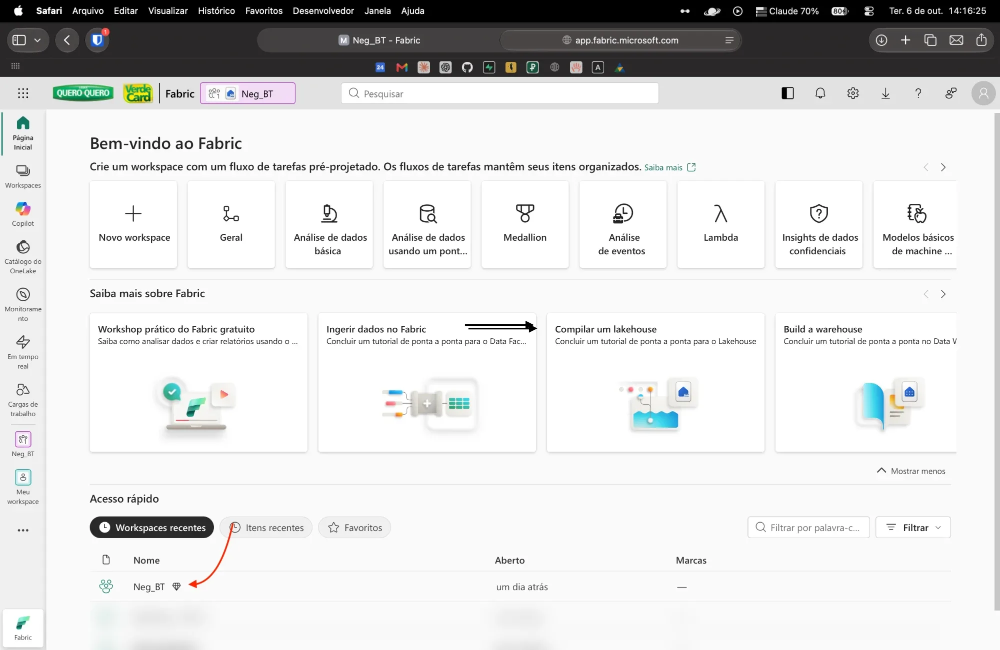
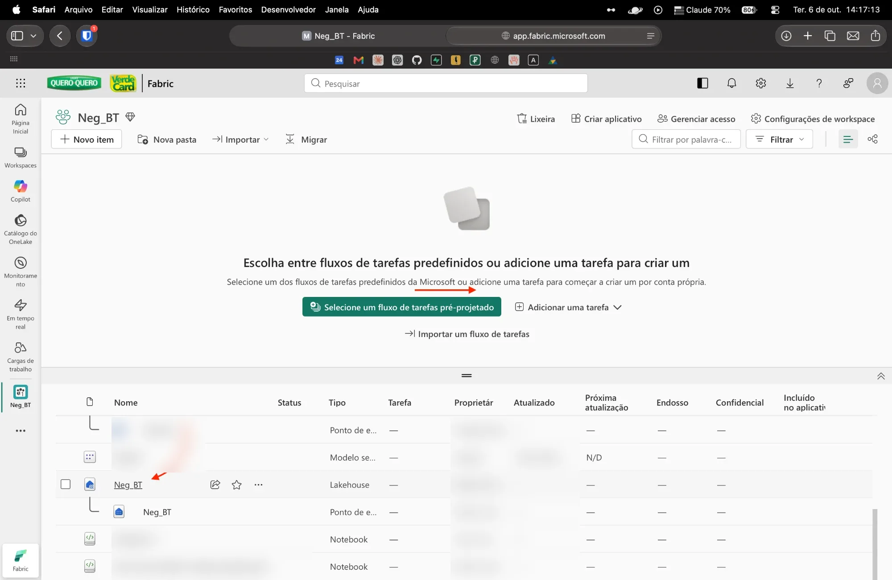
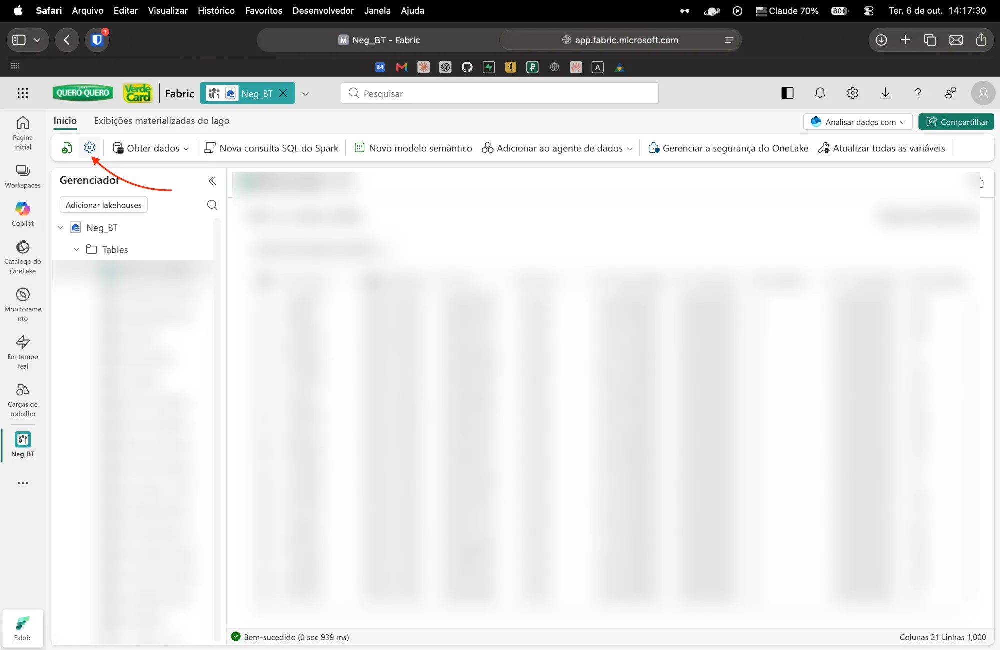
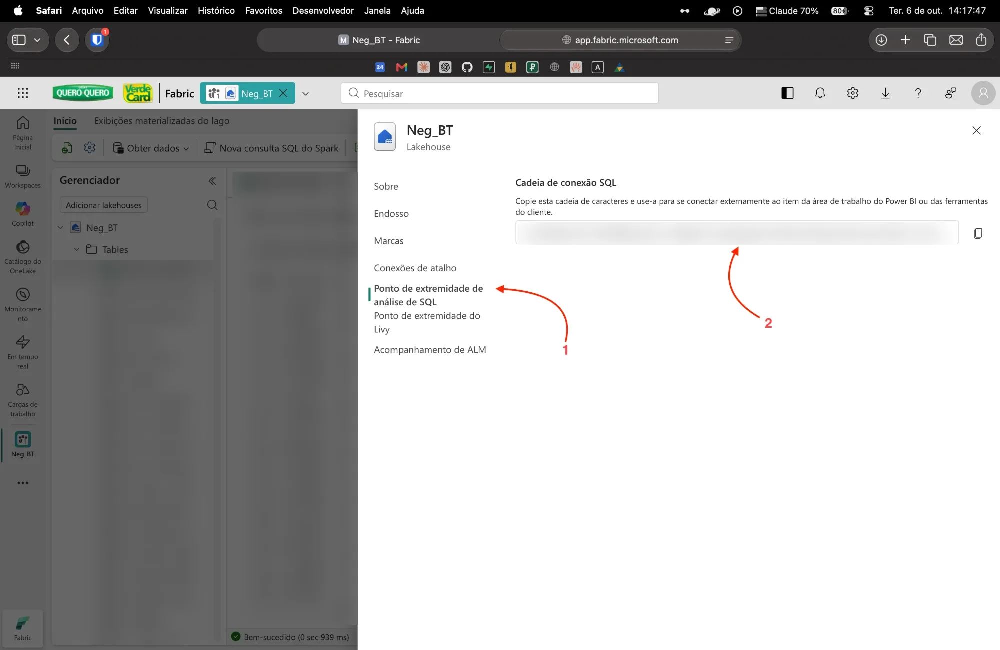

# fabric-skill

Skill do **Claude Code** para consultar o **Microsoft Fabric** (Lakehouse/Warehouse) **somente leitura**, pelo SQL analytics endpoint. Você pede em português ("quanto faturamos por loja no mês passado?") e o Claude escreve e roda o SQL.

Funciona em **macOS 15 (Sequoia) ou mais novo**, **Windows 10/11** (x64 ou ARM) e **Linux** (Ubuntu 20.04+, Debian 11+, RHEL/Fedora 8+, Alpine; x86_64 ou ARM64).

## O que você precisa

- **Claude Code**: aba **Code** do app desktop do Claude, ou `claude` no terminal. O chat comum do claude.ai não serve, porque a skill roda um script no seu computador.
- **Python 3.10 ou mais novo.**
- **Acesso de leitura ao workspace no Fabric** com sua conta da empresa.
- O **link de conexão SQL** do Lakehouse. Veja [como pegar o link](#como-pegar-o-link-de-conexão).
- **Não precisa de senha de banco.** O login é feito no navegador com sua conta Microsoft.

---

## Instalação rápida: só mandar para o Claude

Abra o Claude Code e cole esta mensagem (vale para qualquer sistema):

> Instale a skill https://github.com/VerdeCard-BusinessTech/fabric-skill clonando em ~/.claude/skills/fabric-readonly e depois me ajude a configurar o acesso ao Fabric.

O Claude clona o repositório, instala o ambiente, mostra o guia, pede o link, abre o login da Microsoft e testa. Você só cola o link e faz o login.

---

## Instalação manual

### macOS

```bash
# 1. Python (se ainda não tiver): https://www.python.org/downloads/ ou
brew install python git

# 2. Baixar a skill
git clone https://github.com/VerdeCard-BusinessTech/fabric-skill.git ~/.claude/skills/fabric-readonly

# 3. Instalar o ambiente
python3 ~/.claude/skills/fabric-readonly/scripts/setup.py

# 4. Configurar (mostra o guia, pede o link e abre o login)
~/.config/fabric-readonly/venv/bin/python ~/.claude/skills/fabric-readonly/scripts/fabric_query.py init
```

### Windows (PowerShell)

```powershell
# 1. Python e Git (se ainda não tiver)
winget install Python.Python.3.12
winget install Git.Git
# feche e abra o PowerShell depois de instalar

# 2. Baixar a skill
git clone https://github.com/VerdeCard-BusinessTech/fabric-skill.git "$HOME\.claude\skills\fabric-readonly"

# 3. Instalar o ambiente
py "$HOME\.claude\skills\fabric-readonly\scripts\setup.py"

# 4. Configurar (mostra o guia, pede o link e abre o login)
& "$HOME\.config\fabric-readonly\venv\Scripts\python.exe" "$HOME\.claude\skills\fabric-readonly\scripts\fabric_query.py" init
```

Se `py` não for reconhecido, use `python`.

### Linux

```bash
# 1. Dependências
# Debian/Ubuntu:
sudo apt install -y python3 python3-venv git libltdl7 libkrb5-3 libgssapi-krb5-2
# RHEL/Fedora:
sudo dnf install -y python3 git libtool-ltdl krb5-libs

# 2. Baixar a skill
git clone https://github.com/VerdeCard-BusinessTech/fabric-skill.git ~/.claude/skills/fabric-readonly

# 3. Instalar o ambiente
python3 ~/.claude/skills/fabric-readonly/scripts/setup.py

# 4. Configurar (mostra o guia, pede o link e abre o login)
~/.config/fabric-readonly/venv/bin/python ~/.claude/skills/fabric-readonly/scripts/fabric_query.py init
```

**Linux sem interface gráfica (servidor, SSH, WSL):** o login usa *código de dispositivo*. O terminal mostra um código e o endereço `https://microsoft.com/devicelogin`. Abra esse endereço em qualquer navegador, até no celular, digite o código e entre com a conta da empresa.

### Atualizar

```bash
git -C ~/.claude/skills/fabric-readonly pull
```

No Windows (PowerShell): `git -C "$HOME\.claude\skills\fabric-readonly" pull`

---

## Como pegar o link de conexão

Leva 1 minuto. O mesmo guia abre no navegador durante a instalação. Para reabrir, peça ao Claude *"abra o guia do Fabric"* ou rode o comando `guia`.

### 1. Abra o workspace
Entre em [app.fabric.microsoft.com](https://app.fabric.microsoft.com) e, em **Acesso rápido → Workspaces recentes**, clique no workspace (ex.: **Neg_BT**).



### 2. Abra o Lakehouse
Na lista de itens, clique no item do tipo **Lakehouse** (ícone de casinha azul). O nome dele é o **nome do banco** que a skill vai pedir.



### 3. Clique na engrenagem (Configurações)
Na barra do Lakehouse, clique no ícone de **engrenagem**.



### 4. Copie a cadeia de conexão SQL
(1) No menu lateral, clique em **Ponto de extremidade de análise de SQL**. (2) Em **Cadeia de conexão SQL**, clique no **botão de copiar** à direita.

> ⚠️ **Use o botão de copiar.** O texto na tela aparece cortado com "..." e não funciona se for copiado à mão. O link termina em `.datawarehouse.fabric.microsoft.com`.



### 5. Cole o link e faça o login
Cole o link quando o Claude (ou o comando `init`) pedir. Depois o navegador abre a tela de login da Microsoft: entre com a conta da empresa. A sessão fica salva e se renova sozinha.

---

## Usando

Depois de configurado, é só pedir ao Claude:

- *"Liste as tabelas do Fabric"*
- *"Que colunas tem a tabela X?"*
- *"Me traga o faturamento por filial do último mês"*
- *"Exporte para CSV as vendas de ontem"*

Comandos diretos, se quiser usar sem o Claude (`PY` = Python do ambiente, veja os caminhos acima):

| Comando | O que faz |
|---|---|
| `PY fabric_query.py tables [--like texto]` | lista tabelas e views |
| `PY fabric_query.py describe dbo.tabela` | colunas e tipos |
| `PY fabric_query.py query "SELECT TOP 10 * FROM dbo.tabela"` | roda uma consulta |
| `... query --file consulta.sql --format csv --out saida.csv --max-rows 0` | exporta tudo para CSV |
| `PY fabric_query.py profiles` | lista os Lakehouses configurados |
| `PY fabric_query.py setup --profile nome --server <link> --database <Lakehouse>` | adiciona outro Lakehouse |
| `PY fabric_query.py guia` | abre o guia com os prints |

## O que fica salvo no seu computador

Tudo fica em `~/.config/fabric-readonly/` (no Windows, `%USERPROFILE%\.config\fabric-readonly\`):

- `venv/`: ambiente Python (`mssql-python` e `azure-identity`).
- `config.json`: link e nome do banco de cada perfil.
- `auth_record.json`: identifica a conta logada. Não contém senha nem token.
- Token de acesso: guardado no cofre do sistema (Keychain no macOS, DPAPI no Windows, libsecret no Linux). Em Linux sem libsecret, fica num arquivo acessível só ao seu usuário.

Para desinstalar, apague as pastas `~/.config/fabric-readonly` e `~/.claude/skills/fabric-readonly`.

## Segurança

- Aceita só consultas `SELECT`/`WITH`, uma por vez. `INSERT`, `UPDATE`, `DELETE`, `DROP`, `EXEC`, `SELECT INTO` etc. são bloqueados antes de chegar ao servidor.
- A conexão é aberta em modo leitura (`ApplicationIntent=ReadOnly`), sem autocommit, e termina sempre com rollback.
- O endpoint SQL de um Lakehouse já não permite escrita nas tabelas.
- Cada pessoa só enxerga o que a própria conta tem permissão de ver no Fabric.

## Problemas comuns

| Sintoma | O que fazer |
|---|---|
| `Login failed` / erro 18456 | Sua conta não tem acesso ao workspace. Peça acesso de leitura ao dono. |
| Timeout ou host não encontrado | O link foi copiado cortado (use o botão de copiar) ou a VPN/firewall bloqueia a porta 1433. |
| Navegador não abre no login | Rode `login --device-code` e use o código em microsoft.com/devicelogin. |
| Linux: erro de biblioteca ao conectar | Instale as dependências da seção Linux. |
| `py`/`python3` não encontrado | Instale o Python 3.10+ (veja a seção do seu sistema). |
| Tabela nova não aparece | O endpoint SQL leva alguns minutos para sincronizar. |
